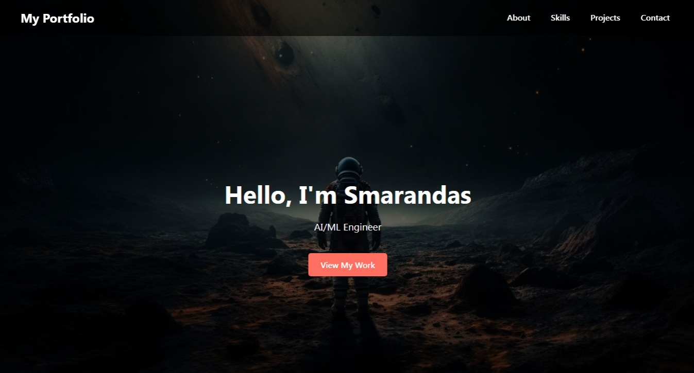
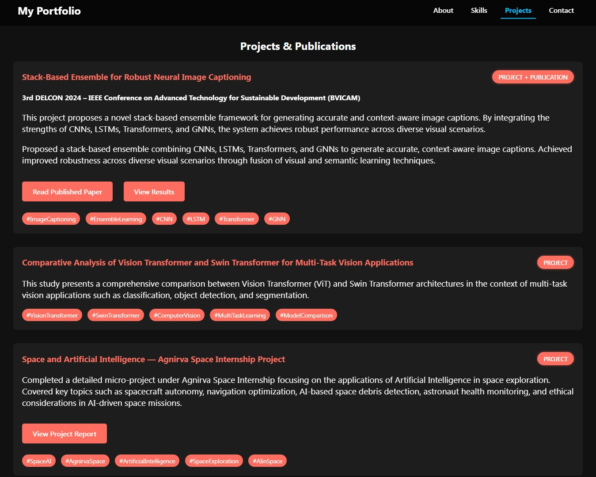
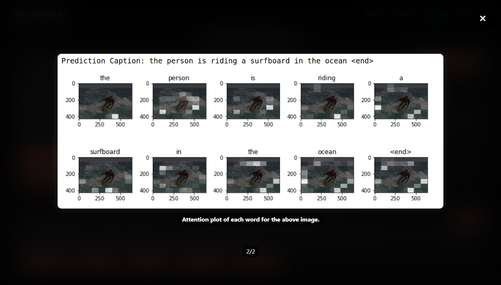

# 🌟 Smarandas Kardas - Personal Portfolio Website

Welcome to my personal portfolio website!  
This site showcases my projects, skills, internships, achievements, and my passion for AI/ML, Quantum Computing, and Space Exploration.

🚀 **Live Website**: [smarandas-kardas.github.io/smarandas-portfolio](https://smarandas-kardas.github.io/Smarandas-Portfolio/)

---

## 📄 Features

- Responsive and interactive design
- Image slider for project results
- Tooltips for enhanced understanding
- Organized sections:
  - About Me
  - Skills (AI/ML, Programming, Tools, Soft Skills)
  - Education & Internships
  - Projects & IEEE Publications
  - Certificates & Achievements
  - Contact Links

---

## :package: Built With

- **HTML5**
- **CSS3**
- **JavaScript**
- [Tippy.js](https://atomiks.github.io/tippyjs/) for tooltips
- Custom modal/slider with keyboard navigation

---

## 📂 Folder Structure

- **├── index.html**
- **├── styles.css**
- **├── 93611.jpg # Hero background**
- **├── surfboard.png, attention.png # Slider images**
- **├── resume.pdf # My resume (integrated into site)**
- **├── certificates/ # Certificate PDFs**
- **├── projects/ # Project reports or papers**
- **|── assets/ # Optional: for icons, images, etc.**

---

## 📜 Resume

My full resume is available in the [Resume section](https://smarandas-kardas.github.io/Smarandas-Portfolio/#resume) of the website.

---

## :email: Contact

- Email: [smarandas.kardas@gmail.com](mailto:smarandas.kardas@gmail.com)
- LinkedIn: [linkedin.com/in/smarandas-kardas](https://linkedin.com/in/smarandas-kardas)

---

## :telescope: Future Plans

I aim to expand this portfolio with:

- Blog integration (via Markdown/Notion)
- Research updates
- Real-time GitHub stats & activity

---

## 🔖 License

This project is open source and free to use. Give credit if you find it helpful!

---

## 📷 Hero Section Preview

This section introduces me with a full-screen background, overlay, and animated scroll navigation.

---

## 💡 Projects Section

The projects section showcases my key work including published research, internship projects, and advanced model comparisons. Each card includes tags, detailed descriptions, and buttons to view results or papers.

---

## :framed_picture: View Results Preview

This modal slider displays predicted captions and attention plots for image captioning models. It uses a full-screen overlay with keyboard and mouse navigation support.
